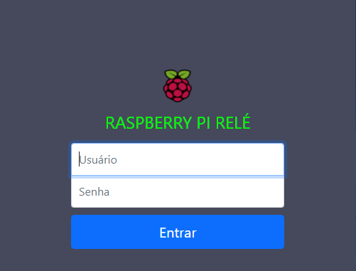
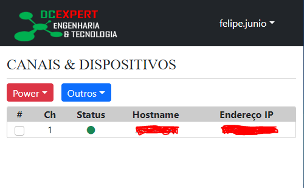

<h1>Raspbarry PI: Automatização RELÉ</h1>

Este projeto foi criado com intuito de automatizar o acionamento de Relés, pois houve demanda de ligar os servidores 
físico quando houvesse uma queda de energia, assim, se não houver ninguém no local passa ser possível ligá-los 
via interface WEB.

<h2>Recursos Utilizados</h2>

<ul>
    <li>Python 3.9 com Flask</li>
    <li>Bootstrap 5.0</li>
    <li>FontAwsome 5.0</li>
    <li>Jquery 3.5</li>
    <li>Servidor Apache 2.4 com modulo WSGI</li>
    <li>SGBD MySQL 8.0</li>
    <li>RaspBarry PI 4</li>
    <li>Modulo Relé 3 canais</li>
</ul>

<h2> Não Implementado </h2>
<ul>
    <li>Auditoria de acesso</li>
</ul>

<h2> Demo </h2>

